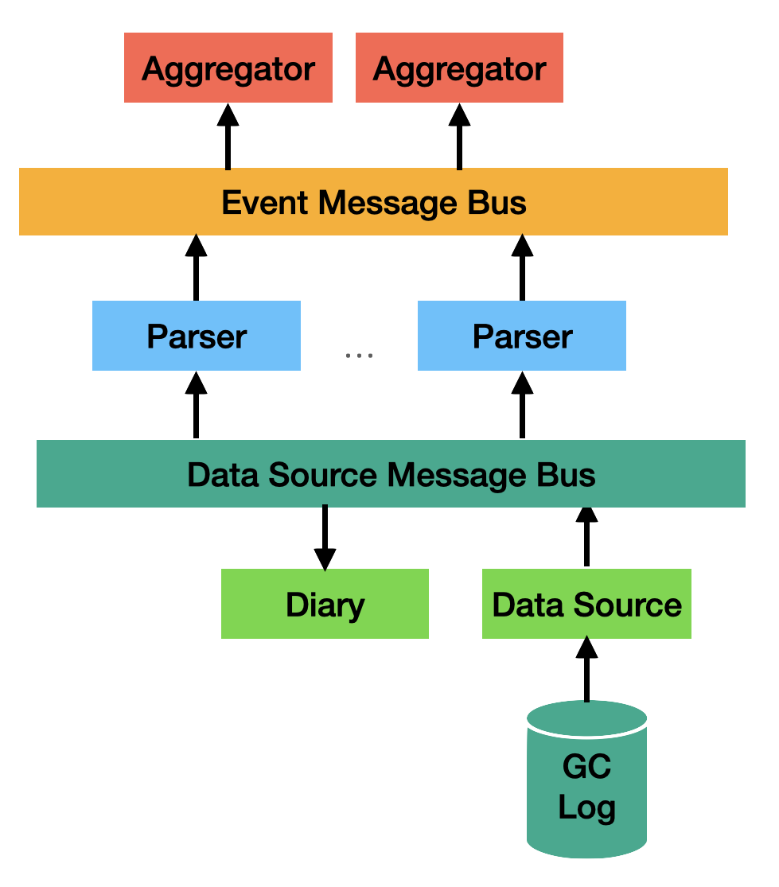
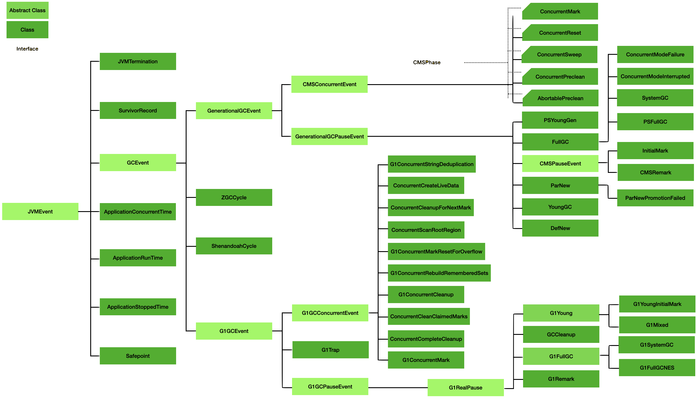

# Microsoft GCToolKit Developers Guide

---

## Introduction

GCToolkit is comprised of 3 Java modules, vertx, parser, and api. This document describes how each of these modules fits together to support the conversion of a garbage collection log to a stream of garbage collection events.
Additionally, GCToolkit contains several components that perform the heavy lifting. These components include, a framework to interact with data sources, diary, data source bus, parsers, and event source bus and finally, a framework to support the aggregation of events.
The purpose of this document is to provide a brief description of each of these components to aid in the further development of this toolkit.

Fig 1. GCToolKit Component Map

### Vert.x Message Bus and Verticles

GCToolkit contains 2 different configurations of a Vert.x event bus. The first configuration supports the publishing of log lines. The second supports the publishing of GCEvent objects. GCEvent objects which will be covered in an upcoming section of this document.

A second feature of Vert.x that GCToolkit is dependent on is the construct of a Verticle. A verticle acts as a container to encapsulate a component designed to process events. In GCToolkit vertices are used to encapsulate the DataSource, parsers, and aggregators. Vert.x takes care of many of the concerns that one has when distributing the processing events. In addition, verticals are a covenant abstraction that nicely supports strong separation of concerns.

 
### Data Source 

DataSource is an interface that allows one to define specializations for a source of GC events that maybe of interest. Currently the toolkit contains two data sources, a FileDataSource and a SafepointogFile. A GClogFile is a specialization of a FileDataSource. This is in turn has two specializations, SingleGCLogFIle and RotatingGCLogFile. The concrete classes take care of the details of being able to create a continuous stream of their contents.

Another role of the DataSource is to provide a Diary (or summary) of important features found in the data. This would include information such as, is this a unified log or a pre-unified log, which version of the JVM produced the file. What flags where used to produce the file, which collector (combinations) are in play and so on. This information is used to construct the data paths through GCToolkit. It may also be used by clients of GCToolkit for their own purposes. For example, analytics may use the information to modulate how they process data.

An example of this would be an analytic that looked at System.gc() behaviour. In JDK 1.7.0_40 the logs stopped reporting user triggered collections unless a new flag was enabled. This left the analytic blind to these events. In JDK 1.8.0, this new flag was automatically turned on when the PrintGCDetails flag was set. Making the analytics aware of the JDK version allowed them to calculate when System.gc() was likely being called thus enabling the analysis when the cause was missing in the log.

###Parsers

The parsers extract information from the log files and generation JVMEvents. All JVMEvents share the same 3 characteristics; the type of the event (reflected in the class), the time of the event, and the duration of the event. These properties are immutable and as such, the creation of a JVMEvent is delayed until they are known. The parse rules make heavy use of regular expressions. This is done so that the parser can make a best effort to extract information from a log even if that log is mixed with output from an unexpected source of the log or, the logs lines are some how corrupted.

The currently existing parsers are generational, G1, Z, and Shenandoah. The generational parser cover the serial, parallel (PSYoung, PSOld), ParNew, CMS, and iCMS collectors. There are separate parsers for unified and pre-unified logs produced by the generational and G1 collectors. The pre-unified generational collectors should cope with logs produced by JDK 1.4.2 whereas the G1 log parsers are for JDK 8+. ZGC support starts at JDK 16 whereas Shenandoah starts at JDK 11.

The flow through the parser starts with it accepting a log line. The line is run through a set of filters designed to recognize if we are interested in parsing it or not. If we are interested, the line is run over a set of regular expressions encapsulated in a class called GCParseRule. If the line hits a GCParseRule, a corresponding parse method is called. The values extracted from the log lines will be stored in a forward reference. This forward reference will be called upon to create the event once all of the lines for that GC event have been scanned. The event is then published on the JVMEvent message bus.

An example of a GCParseRule can be seen in the code fragment below.

GCParseRule CONCURRENT_CYCLE_END = new GCParseRule("CONCURRENT_CYCLE_END", "Concurrent Cycle " + CONCURRENT_TIME);

This rule is designed to capture the unified log message (as can be seen below) that signals the normal completion of a concurrent cycle. All GCParseRules are designed to capture either a single line or a group of strongly related lines.

[73.171s][info ][gc            ] GC(263) Concurrent Cycle 89.437ms

If we look at the rule we can see that it has a name followed by a regular expression pattern. The pattern in this case has bee built up with the customer clause “Concurrent Cycle “ which is then followed by the String CONCURRENT_TIME. CONCURRENT_TIME is defined to be the same format as PAUSE_TIME. PAUSE_TIME is defined as TIME followed by 0 or 1 space which is then followed by either sec, secs or ms. TIME is an optional negative sign (“-“ followed by a REAL_NUMBER. The number is contained within a regex capture group. A REAL_NUMBER is an INTEGER followed by a decimal separator (. or ,) and another INTEGER value. Finally, INTEGER is defined as a sequence of numbers of length 1 or more.

String CONCURRENT_TIME = PAUSE_TIME;
String PAUSE_TIME = TIME + "\\s?(?:secs?|ms)";
String TIME = "(-?" + REAL_NUMBER + “)";
String REAL_NUMBER = INTEGER + DECIMAL_POINT + INTEGER;
String DECIMAL_POINT = "(?:\\.|,)";
String INTEGER = "\\d+";

Since many lines contain either a pause or concurrent time, defining these “tokens” eases the complexity of creating and debugging the parse rules.

####Testing

There are two main types of tests that are used to QA parsers and rules. The first is known as a rules capture test. In this test the rule is exposed to everything that it is likely to encounter. The test passes if the rule captures everything it should capture and doesn’t capture anything else. In the former test, the parser is configured to send generated events to the test. The test the counts each of the different types of events. The test passes if the counts for each event type reach the expected value.

There is a third test that has, unfortunately, not bee applied to all parsers as of yet. In this test, the parsers will parse a log fragment to produce a well known event. The test passes if all of the attributes of that event match the expected value.

For historical reasons, SurvivorSpace is treated as a JVMEvent even though in reality, it’s an attribute of a young generational collection. This record is created by a parser that is specialized to parse the log and extract out the survivor information.

### JVMEvent

A JVMEvent represents something that happened in the JVM. The primary attributes are the type of event, the time of the event, and it’s duration. Each specialization of JVMEvent will contain attributes that are specific to that event. For example, a PSYoung represent a Parallel Young generational collection. In addition to the information above, it will have heap occupancy before and after the collection along with the size of heap before and after the collection. The event may contain more information depending upon the level of detailed information in the log file. As previously mentioned, any survivor space data will be ignored as that is dealt with in its own event.  A complete set of events can be seen in the diagram below. A complete discription of each event can be found in the corresponding JavaDoc.

Figure 2. GCToolkit Event Hierarchy

### Aggregator and Aggregation

As can be seen in Figure 1, the end point for delivery of a JVMEvent as far as the framework is concerned, is an Aggregator. Aggregator classes must be provided by the users of GCToolkit as they are not provided as they are considered out of scope for this project. The role of the Aggregator is to capture the JVMEvent objects that are of interest to it and the extract the data of interest and pass it along to an Aggregation.

As is the case with Aggregator, Aggregation classes must be supplied by users of GCToolkit. The role of an Aggregation is to collect the data and perform all calculations needed to transform the event data into a form that fits the needs of the client. For example, a GUI may want to display heap occupancy after collection. The Aggregator would capture all GC pause events from which contain reasonable accurate measures of this metrics. This information would be collected into an Aggregator.

    It is the responsibility of GCToolkit to load and register all instances of Aggregation via the module’s SPI
<todo: show sample code>

## License

Microsoft GCToolKit is licensed under the [MIT](https://github.com/microsoft/gctoolkit/blob/master/LICENSE) license.
